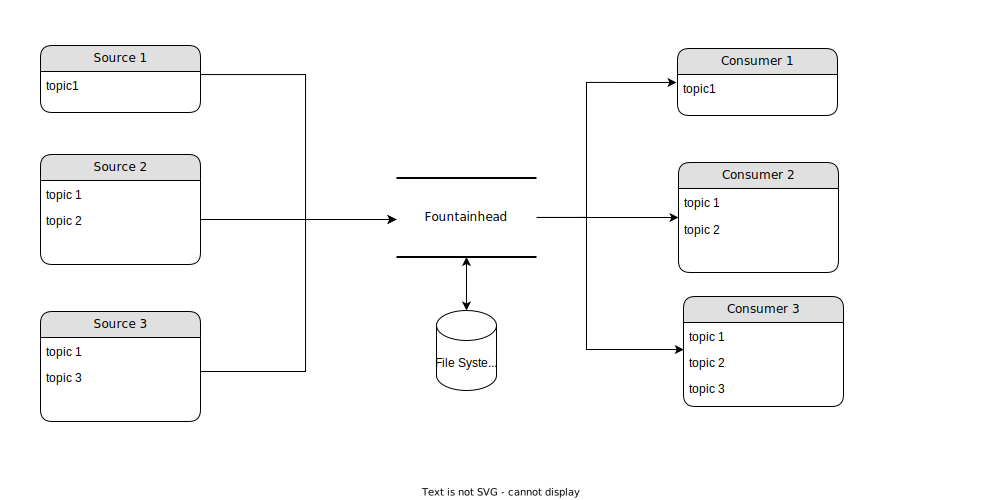

A stored event queue solution for building event based systems easily. Fountainhead will essentially do two things store events sequentially by topic and notify any subscriber in real time. This is meant to be used as the unique source of truth feeding data to arbitrary number of dependant systems (database, datalake, monitoring dashboard, data cube, etc...) in highly reliable way.



One can easily subscribe to those topics to process events starting from any point in time and receive new events from then onward. This allows any subscriber to catch up from where it previously stopped. It is safe by desgin thanks to its append only nature (think Git), although can still rewrite the past if need be.

## How to use it

One can save events as follows.

``` python
with create_sync_client(server_host, server_port, name="producer") as client:
        topic = "uploads/client_1"
        payload = {"value": 1}
        time_stamp = client.write_event(topic, payload)
```

This will save the payload under *uploads/client_1* topic. Events can be read starting from any point in time.

``` python
with create_sync_client(server_host, server_port, name="consumer") as client:
    with client.read_events("uploads/client_1") as events:
        for time_stamp, value in events:
            print(time_stamp, value)
```

This will display all the events saved under *uploads/client_1* topic from the beginning then will return newly saved ones. You can specify the beginning and the end of the iteration using *start* and *end* arguments.

## 